# GPT-Image 2.5 · 假期出片 12 种玩法

 ChatGPT Image 2.5** 照片编辑玩法合集：提示词可直接复制，效果图按玩法编号归档。

原帖：[数字生命卡兹克 · 12 种玩法](https://x.com/Khazix0918/status/2104401048324743646)（2026-09-28）

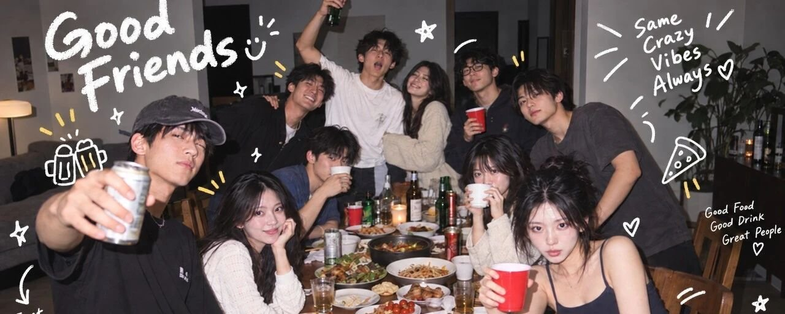

---

## 你需要什么

- [ChatGPT](https://chatgpt.com)（能用 **创建图像 / Image 2.5**）
- 自己的照片（旅游、自拍、合照、美食等）
- 本仓库 `examples/` 里的效果图作参考（可选）

---

## 通用操作（所有玩法共用）

1. 打开 ChatGPT → **新建对话**
2. 点输入框左侧 **+** → 选择 **创建图像**（默认即 Image 2.5）

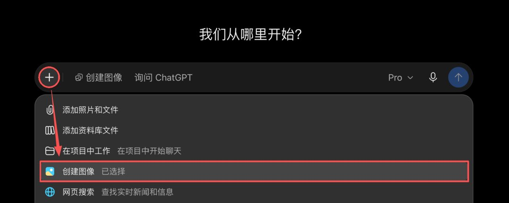

3. **上传照片**，粘贴对应提示词，发送
4. 需要「点哪改哪」时：放大图片 → 右上角笔形图标 → **添加评论** → 在图上点位置写需求

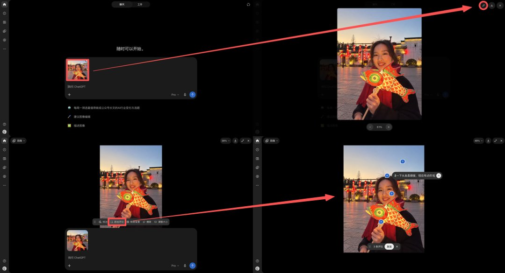

原则：**只说要改的部分，并写明「其他一切不变」**，Image 2.5 的强项就是精准局部编辑。

纯提示词速查见 [`prompts.md`](prompts.md)。

---

## 一、基础玩法

### 1. 消除背景游客

旅游照背景人多、杂物乱时用。

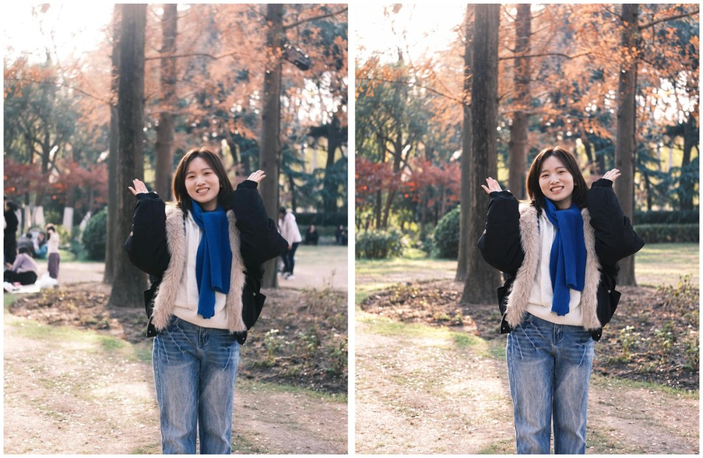

**提示词：**

```
保持图片画面完全不变，仅将背景中的其他人和杂物去掉。
```

### 2. 自动调光

去人后曝光仍过曝 / 偏色时用；复杂多点修改用「添加评论」。

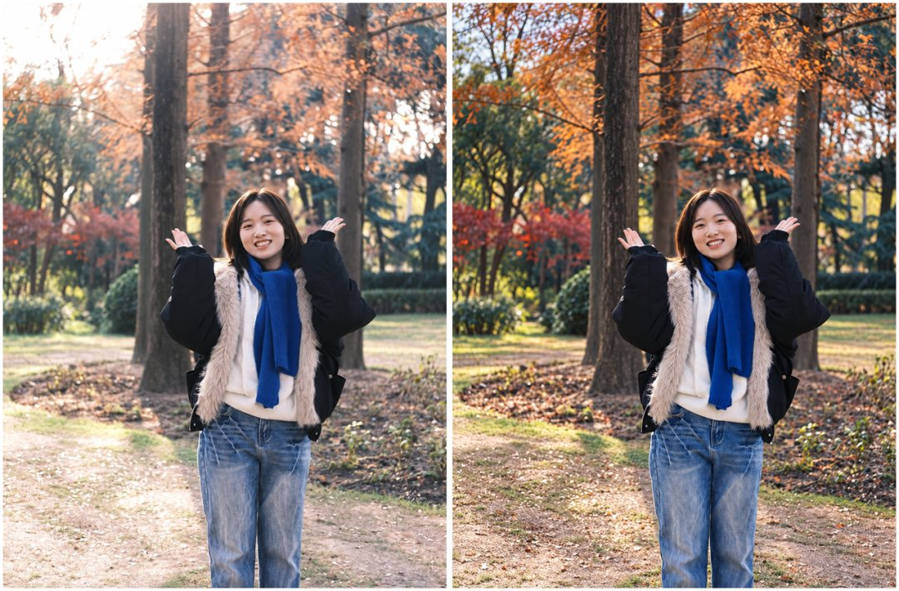

**提示词：**

```
这张照片背景曝光太严重了，请以一个专业摄影师的身份，为这张图调一下光线、色彩和清晰度
```

### 3. 专业美颜

保留人物辨识度的精致优化（发型 / 眉眼 / 肤色 / 唇部）。

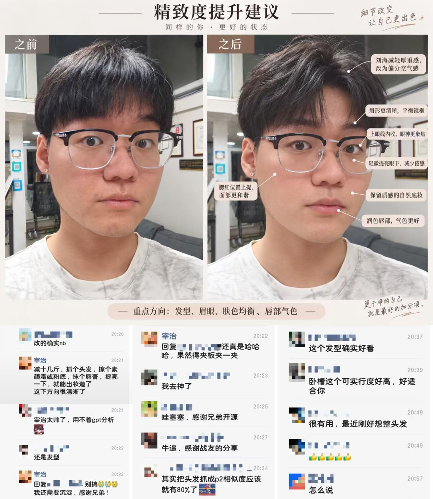

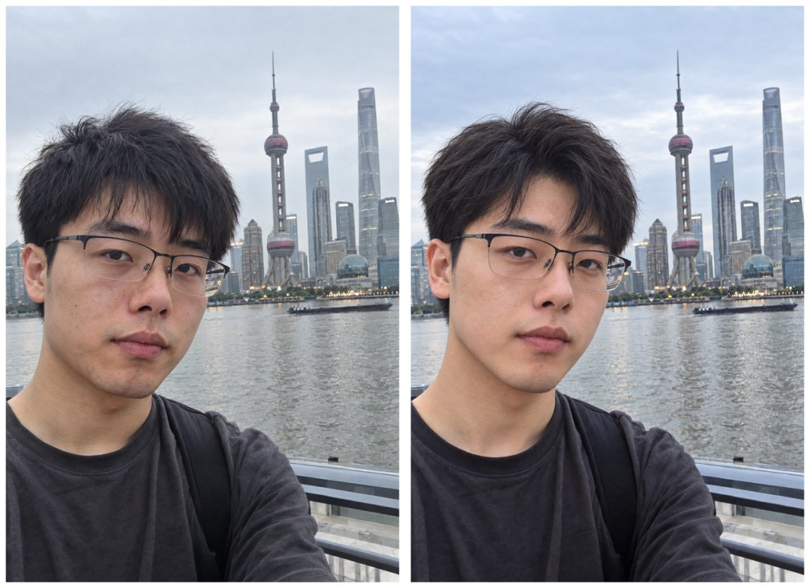

**提示词：**

```
根据照片中人物的实际脸型、五官与气质，进行有针对性的美容美学优化，并直接呈现自然修饰后的效果：调整适合本人的发型、分缝与蓬松度，整理眉形，适度提亮眼下、均匀肤色、淡化痘印，改善唇部状态，必要时加入轻淡自然的妆容，让整体更协调、有精神。除此之外的一切全部不变
```

---

## 二、创意出片

流程统一：**图 + 提示词 = 成片**。

### 4. 拍立得 3D 公仔打卡

人物变 Q 版黏土公仔，破框「走出」拍立得，背景仍是原景点。

**原图素材：**

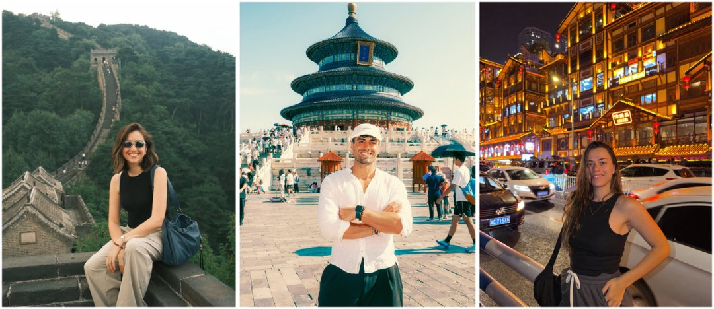

**效果：**

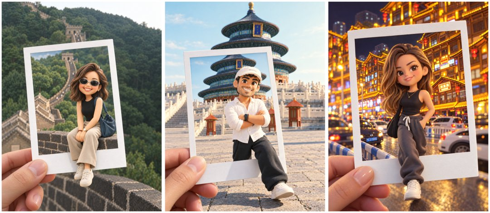

**提示词：**

```
根据图一，将照片中的人物转化为整体约1:4身高比例的3DQ版黏土风格角色公仔，公仔呈现全身，整体放置于一张拍立得照片中，并由一只手持握着拍立得相纸。画面呈现出人物从拍立得照片中突破边框、延伸进入现实世界的效果。并且背景与原图一致，延续拍立得中的背景，以Q版风格绘制，不需再有人物出现，仅作为角色背景的延伸，与照片原始场景一致
```

### 5. 景点明信片

景点照 → 复古手账水彩明信片。

**原图：**

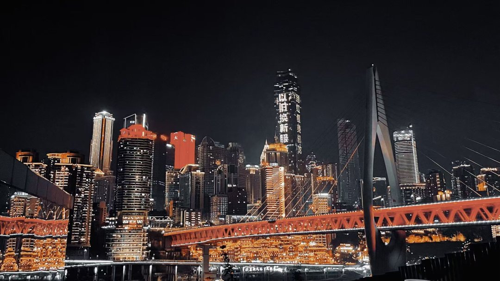

**效果合集：**

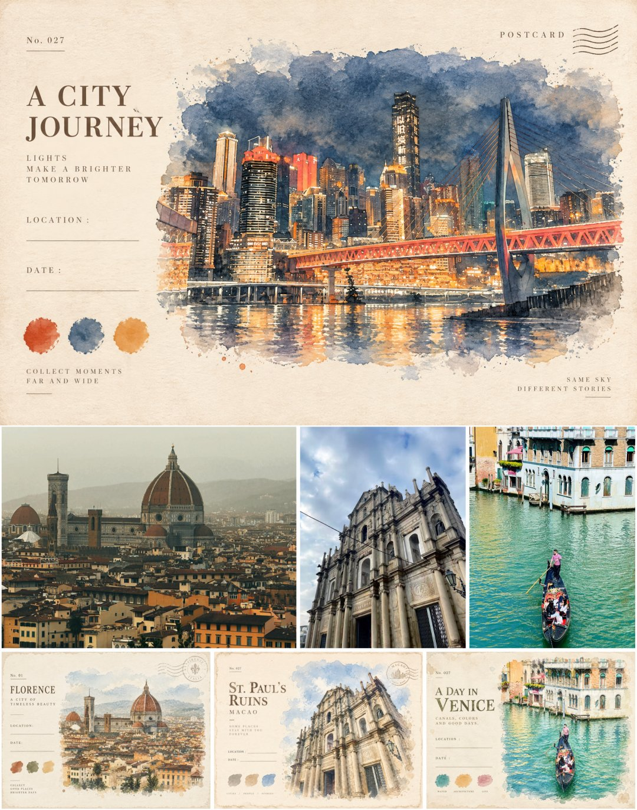

**提示词：**

```
将照片设计成复古旅行手账风明信片：保留原图主体与视角，转绘为清透的水彩插画，带自然晕染、纸张颗粒和不规则笔触边缘，柔和融入暖米白纸面。采用横版布局，右侧约60%区域放插画，插画略微收小，四周留出更宽的纸面，上下边缘保持呼吸感，笔触不要延伸至画布边缘。左侧疏朗排版：小编号、简短英文主题标题、LOCATION与DATE标签及空白横线，底部放三枚从照片提取的手绘色块。标题用复古衬线字体，整体清新、舒展、有旅行收藏感。只输出明信片设计平面图，去除原图水印与界面元素。
```

### 6. 画面主体转贴纸

只把核心建筑 / 主体画成白边手绘贴纸，周围仍是照片。

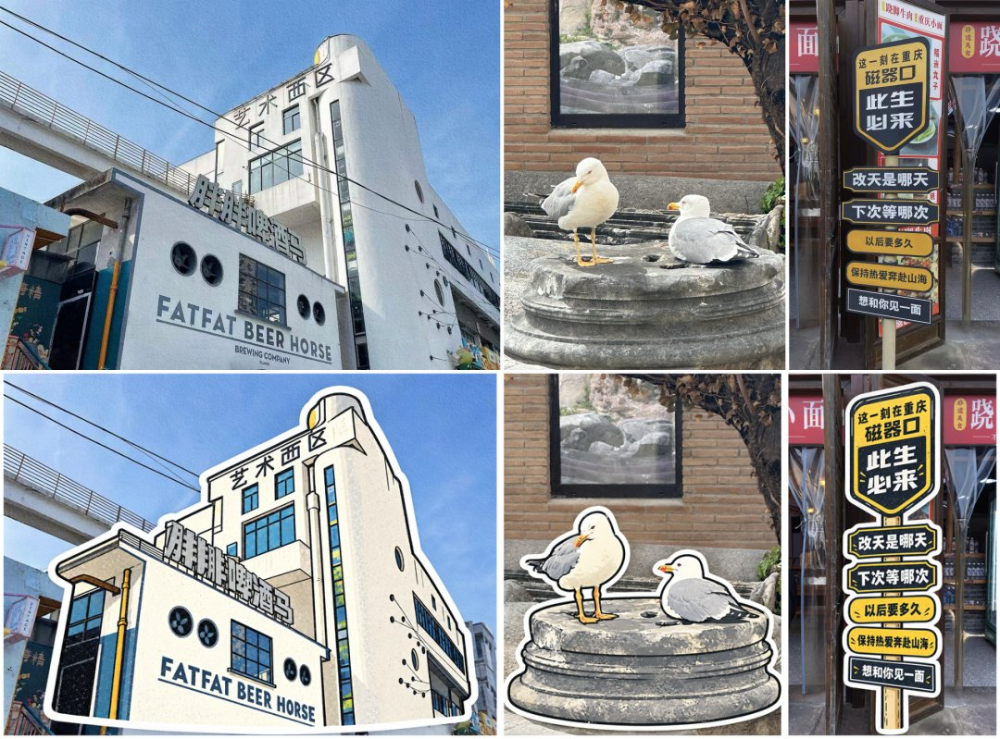

**提示词：**

```
将照片中间「最具辨识度的一座核心建筑」，重绘成手绘旅行贴纸。只处理这一处，保留其轮廓、比例与标志性细节，使用粗黑手绘线条、明快平涂色块和少量复古印刷纹理，沿外轮廓添加连续的宽白色模切边。贴纸原位覆盖建筑，略微放大，避免原边缘外露。周围的一切则保持原照片效果，不添加文字，不将整张图插画化。
```

> 把「核心建筑」改成你要转贴纸的物体即可。

### 7. 旅游碎片行李箱

空行李箱底图 + 多张旅行照 → 水彩贴纸拼贴装箱。

**灵感 / 上传示意：**

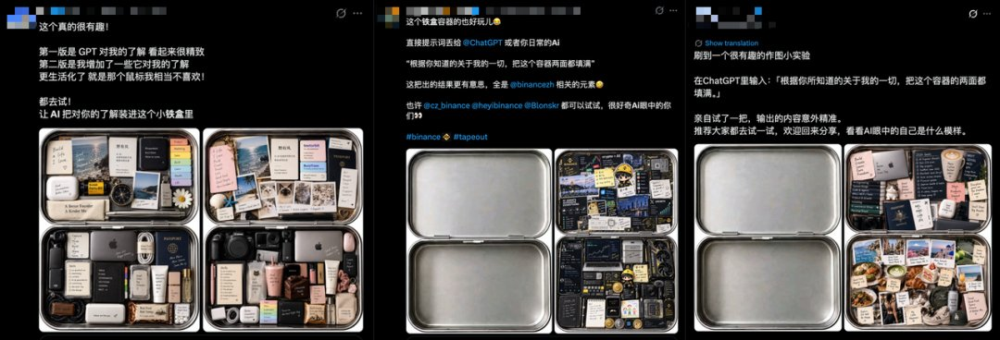

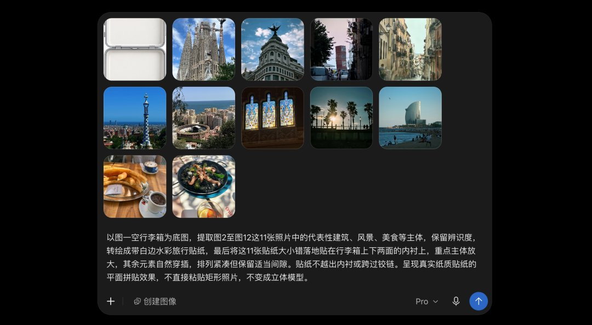

**效果：**

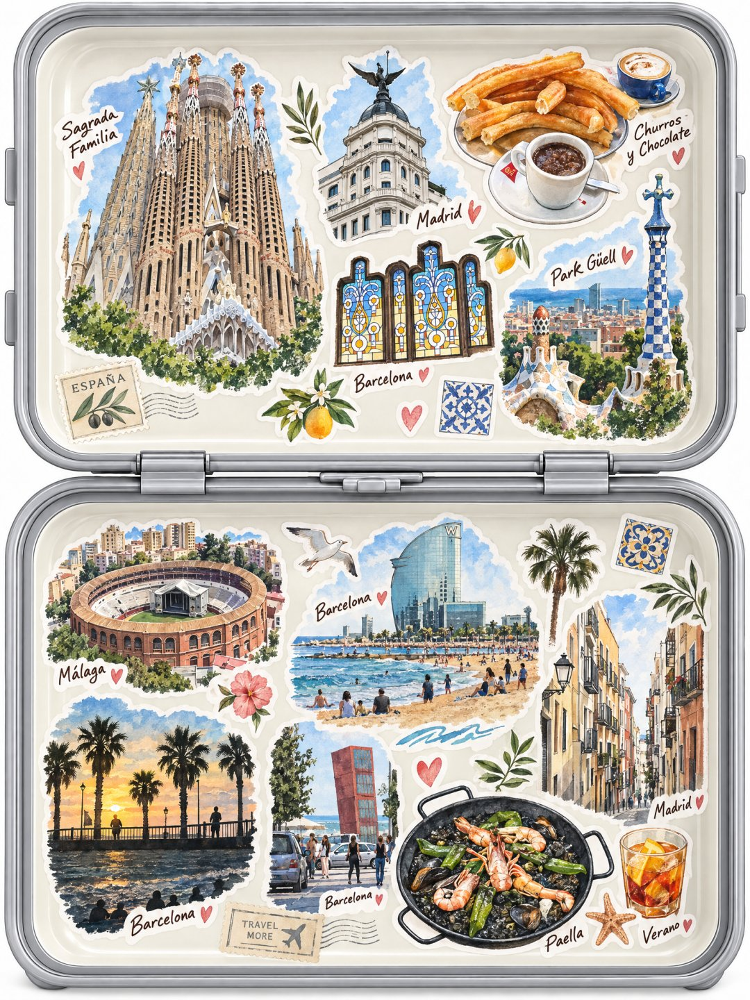

上传顺序：**图一 = 空箱**，图 2～N = 旅行照。张数变了要改提示词里的编号。

**提示词：**

```
以图一空行李箱为底图，提取图2至图12这11张照片中的代表性建筑、风景、美食等主体，保留辨识度，转绘成带白边水彩旅行贴纸，最后将这11张贴纸大小错落地贴在行李箱上下两面的内衬上，重点主体放大，其余元素自然穿插，排列紧凑但保留适当间隙。贴纸不越出内衬或跨过铰链。呈现真实纸质贴纸的平面拼贴效果，不直接粘贴矩形照片，不变成立体模型。
```

### 8. 人物旅游海报 / 宠物绿皮书

只要自拍 + 记得去了哪；宠物版用《绿皮书》海报构图。

**海报 · 原图 / 效果：**

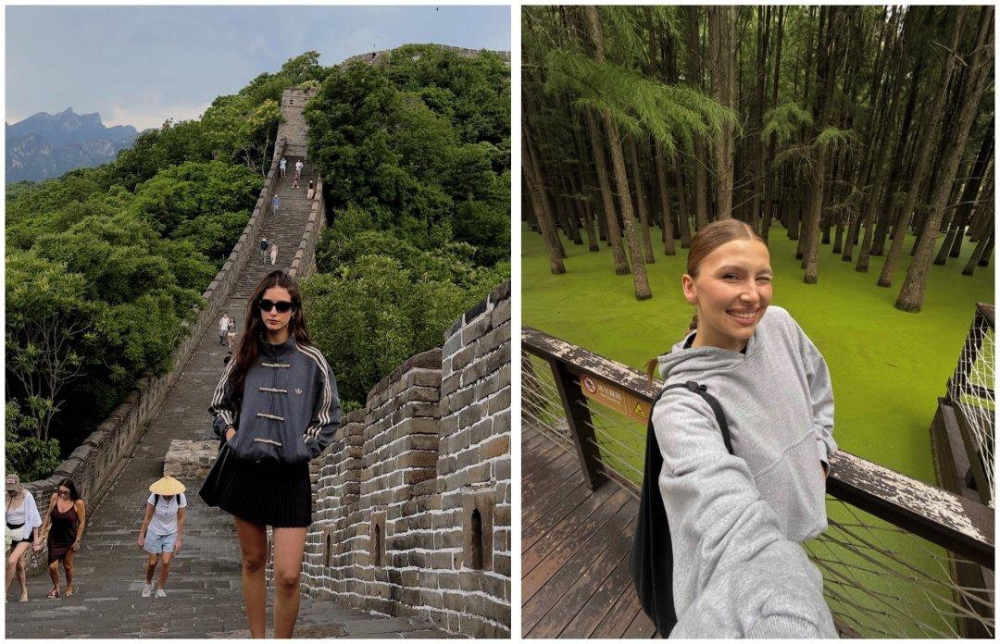

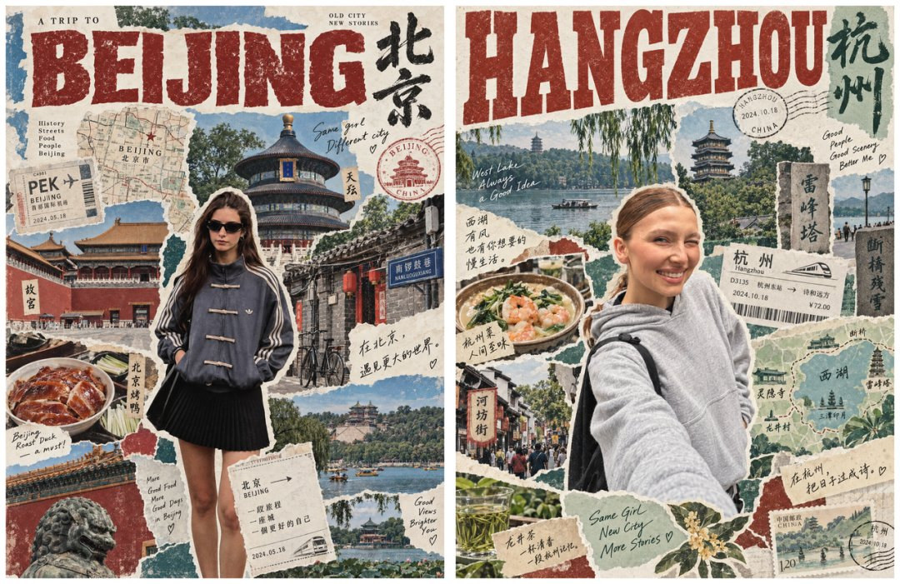

**海报提示词**（把「广州 / GUANGZHOU」换成你的城市）：

```
以参考照片中的人物为主角，创作「广州」主题的复古旅行拼贴海报，保留五官辨识度与自然神态。用醒目的「GUANGZHOU」复古粗体标题，搭配城市地标、街景、美食、地图、票据和邮戳，结合撕纸边缘、印刷颗粒与少量手写短句，构图丰富、层次清晰。以中性米白纸底搭配自然蓝绿与砖红，略微减少黄调，保留复古质感，避免整体泛黄，肤色自然。
```

**宠物绿皮书 · 素材 / 效果：**

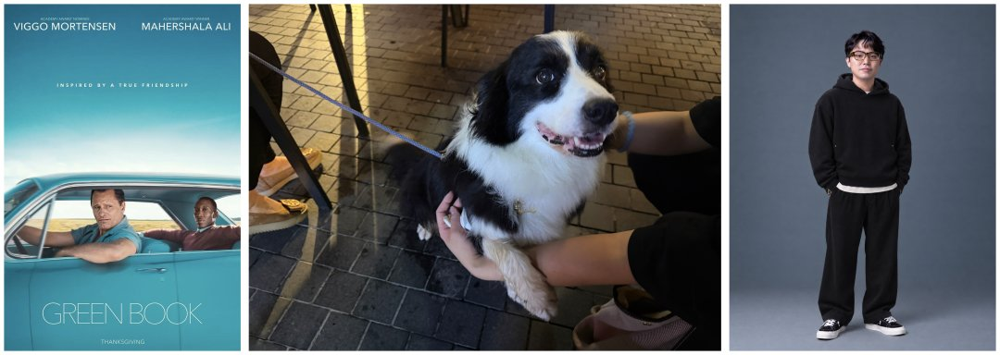

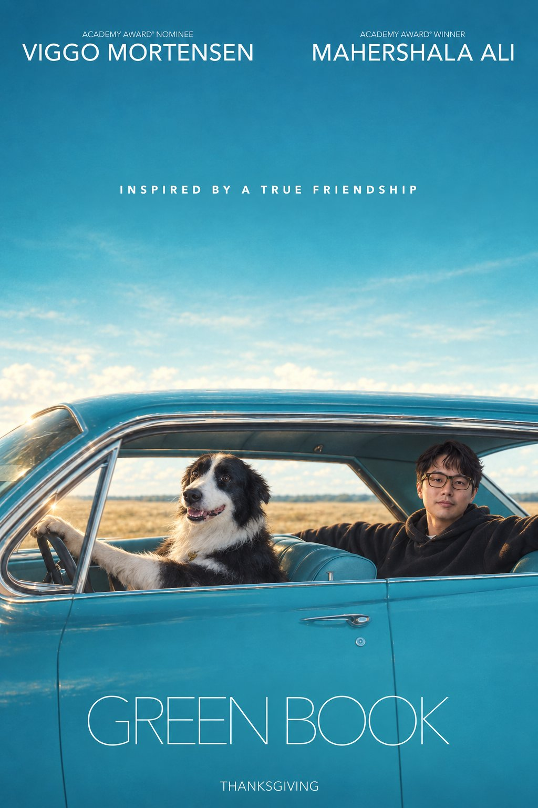

**宠物提示词**（图一海报 / 图二狗 / 图三人）：

```
仅将图一左侧人物替换为图二中的「小狗」，让「小狗」坐在驾驶位开车，右侧人物包括服装则替换为图三中的「角色」。
```

---

## 三、网感大片

### 9. 演唱会氛围感

图一：本人现场照；图二：氛围参考（彩带等）。

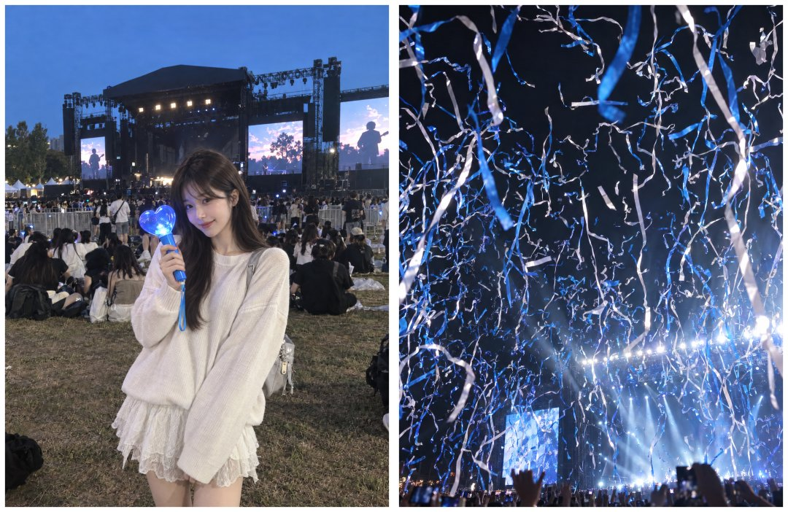

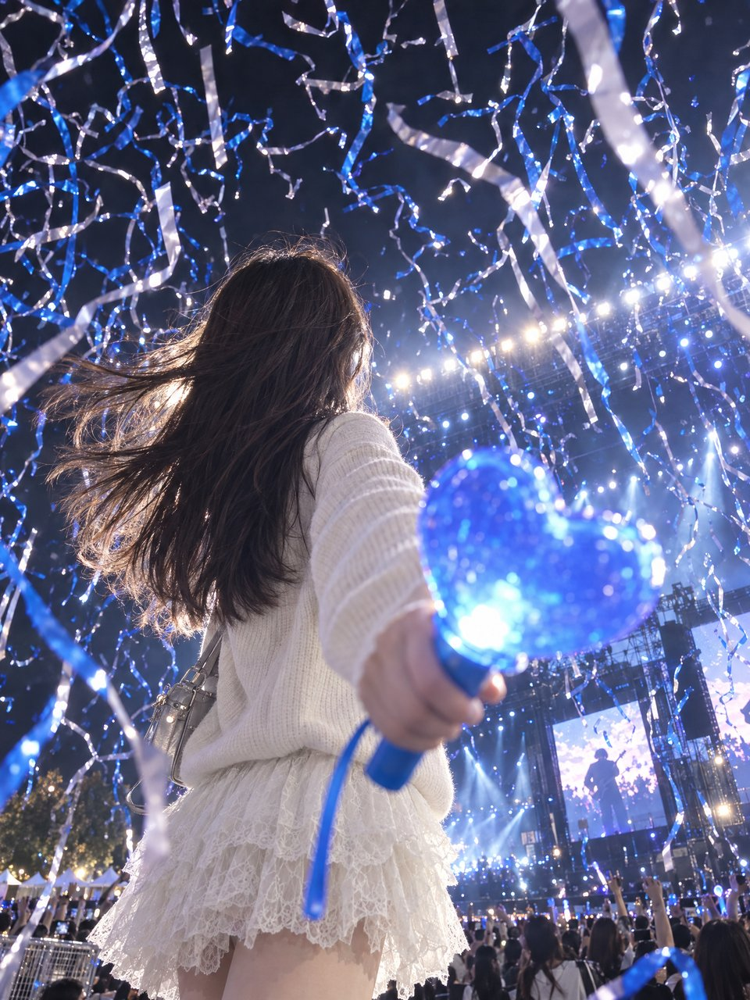

**提示词：**

```
在图一场景下，图一中的人物背对广角镜头，人物的位置偏向画面左边，右手拿着爱心形状的应援棒怼在镜头前并放大，低视角拍摄，人物不留侧脸。画面中的人物长发飘逸，要有风吹动的感觉，发丝间微发光，稍微仰视的拍摄角度，注意整体姿态有美感且协调，并且背景中要有图二的演出会彩带飘落，营造氛围感场景，让整体的光影结构和谐。
```

### 10. 美食炸弹

手持饮品 / 沙拉怼镜头 → 超写实飞溅瞬间。

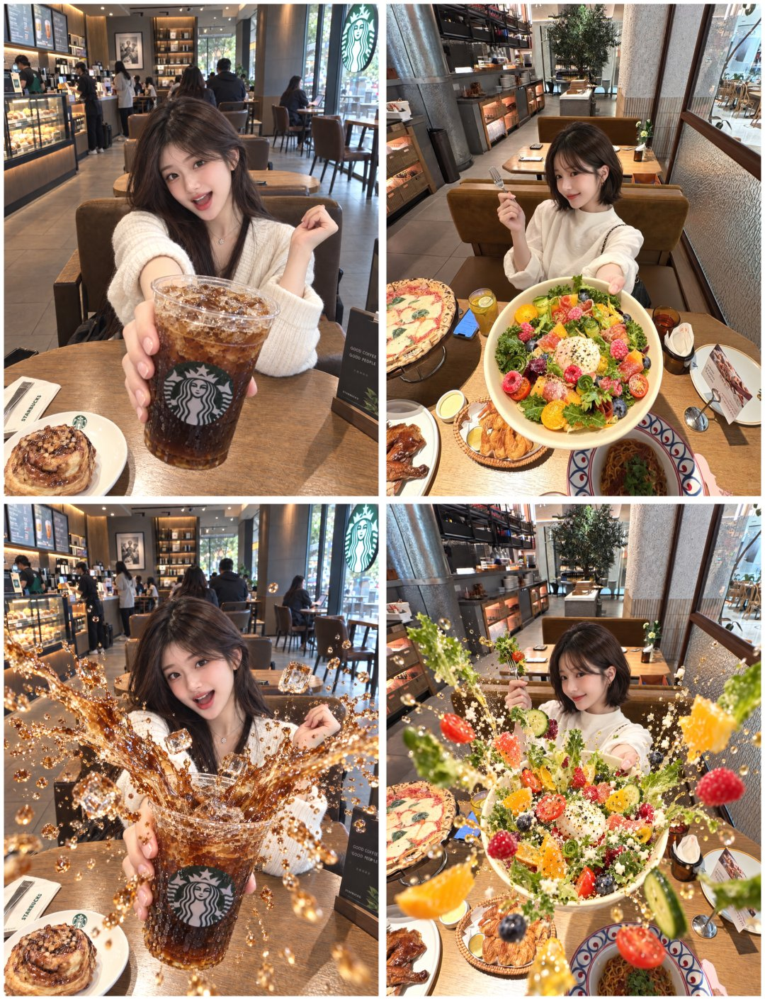

**提示词：**

```
保持图片完全不变，仅以人物手持怼在镜头前的食物或饮品为中心，制造超写实的腾空飞溅瞬间。根据原有内容自然表现：固体翻腾散开，液体形成舒展的飞溅弧面与细小液滴，配料随之悬浮。动势从容器内部向上、向外并朝镜头展开，突出近大远小的透视与扑面而来的冲击感。保持容器完整，不添加无关食材，不遮挡人物面部。材质、光线与阴影融入原照片，呈现高速摄影定格般的清晰细节与广告质感，避免卡通感。
```

### 11. 指定物体转文字涂鸦

把椅子 / 猫 / 车等变成英文单词构成的 Ins 风文字涂鸦。


**提示词：**

```
只修改图中「第一把椅子及其放在椅子上的玩偶」，将这个「椅子」变成由「Chair」这个英文单词构成的彩色（用一种颜色：白色）手绘文字涂鸦，将「椅子上的玩偶」变成由「Cat」这个英文单词构成的彩色（用一种颜色：棕色）手绘文字涂鸦，并且这些文字涂鸦要有质感一些。文字自上而下排列，笔画大胆拉伸、弯曲、嵌合。采用圆润粗笔画、略带抖动的白色描线对整体以及一些空缺的地方进行勾勒补充，文字与描线之间保持透明镂空，除了文字以外，不得出现其他带颜色的色块笔画。让文字本身配合白色手绘描线构成「椅子和玩偶」，而不是在椅子和玩偶上贴字，整体呈现ins风。
```

> 替换引号里的物体名、英文单词、颜色即可复用。

### 12. Ins 风画面注释

整图加手写标题、箭头、星星等涂鸦（封面大图同款）。

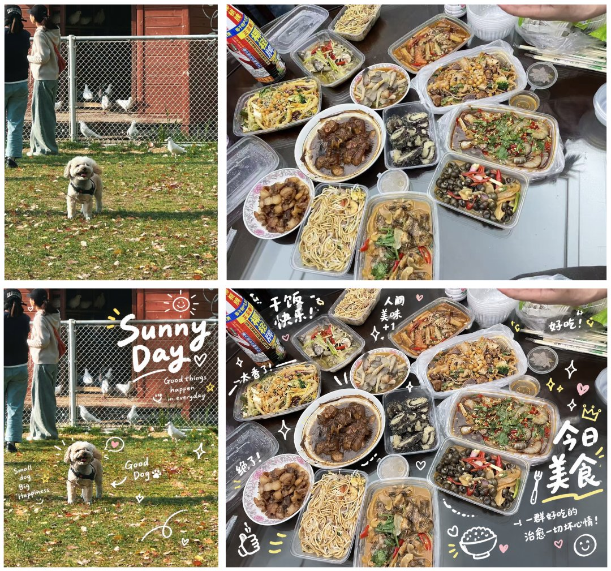

**提示词：**

```
为照片添加ins风手绘涂鸦排版，保留原照片内容、构图与真实质感。根据画面内容，在空白处添加醒目的白色手写标题和一句简短俏皮的文案，笔画圆润、略带不规则感。搭配少量手绘箭头、星星、闪光、弧线与呼应主题的小图案，以白色为主、其他颜色做点缀。文字与涂鸦自然穿插，活泼随性、疏朗有留白，像亲手记录的生活照片。避开人物面部与重要主体，不堆满装饰，不将照片转成插画，不添加水印。
```

---

## 快速对照表

| # | 玩法 | 典型用途 | 效果图前缀 |
|---|------|----------|------------|
| 1 | 消除背景游客 | 旅游废片救场 | `01-` |
| 2 | 自动调光 / 添加评论 | 曝光、局部精修 | `02-` |
| 3 | 专业美颜 | 朋友圈证件感 | `03-` |
| 4 | 拍立得 3D 公仔 | 景点打卡可爱风 | `04-` |
| 5 | 景点明信片 | 风景卡片 | `05-` |
| 6 | 主体转贴纸 | 建筑/地标突出 | `06-` |
| 7 | 行李箱拼贴 | 一趟旅行一张总结 | `07-` |
| 8 | 旅游海报 / 宠物绿皮书 | 懒得拍也能发 | `08-` |
| 9 | 演唱会氛围感 | 音乐节大片 | `09-` |
| 10 | 美食炸弹 | 探店封面冲击力 | `10-` |
| 11 | 物体文字涂鸦 | Ins / 小红书 | `11-` |
| 12 | 画面注释 | 聚会合照加分 | `12-` / `00-cover-` |

---

## 版权与说明

- 文案与玩法整理自公开 X 长文；效果图为原帖配图备份，便于离线查阅。
- 请用**自己的照片**生成内容；勿未经授权商用他人肖像。
- Image 2.5 界面若有改版，以 ChatGPT 当前「创建图像」入口为准。

原作者：[数字生命卡兹克 @Khazix0918](https://x.com/Khazix0918)
